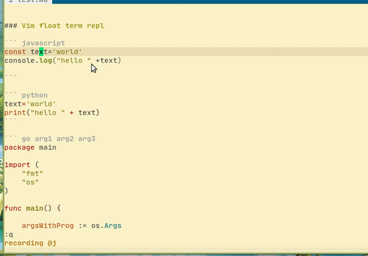

# 
Run repl code in the floating/popup window.



# Install

This plugin depend on [vim-floaterm](https://github.com/voldikss/vim-floaterm) you need to install it first

using vim-plug

``` vim
Plug 'voldikss/vim-floaterm'
Plug 'windwp/vim-floaterm-repl'
```

# Usage
* run a part of code in script file
  > - Select code and run :FloatermRepl 

* run a block code in markdown file with argument passing
  > - Put cursors in codeblock and run :FloatermRepl (you don't need to select it).
  > - Passing argument to script in codeheader [pic][markdown]

  [markdown]:http://www.url.com "http://www.url.com"


## Key map
``` vim
nnoremap <leader>uc :FloatermRepl<CR>
vnoremap <leader>uc :FloatermRepl<CR>
```
 Press `<ESC>` to exit in floaterm window

## Configuration

* add support for your language by modify runner script

```vim
let g:floaterm_repl_runner= "/home/vim/test/runner.sh"
```

* Sample runner.sh
 ``` bash 
#!/usr/bin/env bash
filetype=$1
filepath=$2
shift
shift
params=$@
echo "Start $filetype $filepath"
echo "====================="
case $filetype in
  javascript | js)
     node $filepath $params
    ;;

  bash | sh)
     bash $filepath $params
    ;;

  go )
     go run $filepath $params
    ;;
  python | python3) 
     python3 $filepath $params
    ;;

  *)
    echo -n "unknown"
    ;;
esac
echo "====================="

 ```

Use can press `q` to exit in floaterm window
